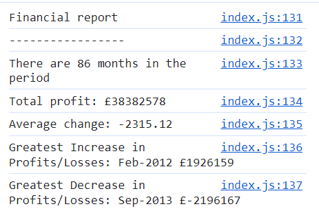

# Console-Finances
## Description
Here, i was provided with an array (seen in the js file) and then had to add code to figure out what the total months were (using array length ) , net profit of loss(using summing in an array),avg of chnages (using array maths with i[i+1]-i[0]) andf finally greatest increase /decrease in the chnages (which was found using min and max maths and then indeing to find the corresponding month).Therefore, this challenge was testing my knowlege of how js worked and how to use and access arrays in order to be able to pull the desired information out. 
The final answer

link to site
## Installation
Press the green  code button in the top right of the screen and copy your desired method (eg. for shh keys copy and use git clone in your terminal)
## License
MIT License

Copyright (c) [2023] [angelica zachowski]

Permission is hereby granted, free of charge, to any person obtaining a copy
of this software and associated documentation files (the "Software"), to deal
in the Software without restriction, including without limitation the rights
to use, copy, modify, merge, publish, distribute, sublicense, and/or sell
copies of the Software, and to permit persons to whom the Software is
furnished to do so, subject to the following conditions:

The above copyright notice and this permission notice shall be included in all
copies or substantial portions of the Software.

THE SOFTWARE IS PROVIDED "AS IS", WITHOUT WARRANTY OF ANY KIND, EXPRESS OR
IMPLIED, INCLUDING BUT NOT LIMITED TO THE WARRANTIES OF MERCHANTABILITY,
FITNESS FOR A PARTICULAR PURPOSE AND NONINFRINGEMENT. IN NO EVENT SHALL THE
AUTHORS OR COPYRIGHT HOLDERS BE LIABLE FOR ANY CLAIM, DAMAGES OR OTHER
LIABILITY, WHETHER IN AN ACTION OF CONTRACT, TORT OR OTHERWISE, ARISING FROM,
OUT OF OR IN CONNECTION WITH THE SOFTWARE OR THE USE OR OTHER DEALINGS IN THE
SOFTWARE.
